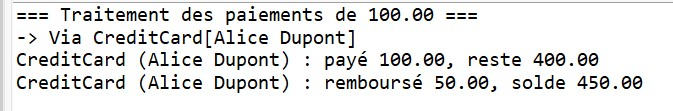
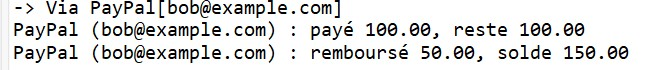
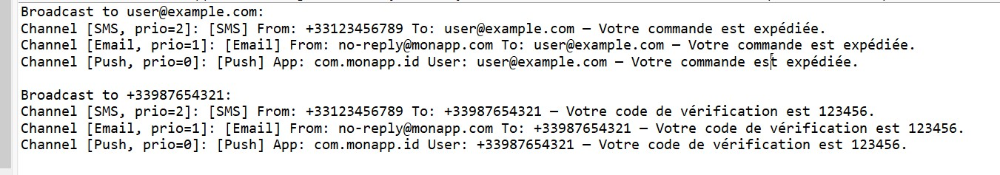

# TP Java – Exercices Divers

## Exercice 1 : Système de paiement extensible

### Description
Ce projet simule un système de paiement avec différents moyens (CreditCard, PayPal, Bitcoin).  
Chaque moyen implémente l'interface `PaymentMethod` et est géré par `PaymentProcessor`.

### Fonctionnalités

1. **Création des méthodes de paiement**
   - CreditCard avec numéro, titulaire et solde
   - PayPal avec email et solde
   - Bitcoin avec wallet et solde en BTC

2. **Traitement des paiements**
   - Chaque méthode tente de payer un montant donné
   - Si paiement réussi, remboursement partiel automatique

### Résultats du programme

#### CreditCard

#### PayPal

#### Bitcoin

---

## Exercice 2 : Système de Notification Extensible

### Description
Ce projet permet de gérer plusieurs canaux de notifications (Email, SMS, Push) via une interface `Notification`.  
`NotificationManager` diffuse les messages en respectant la priorité des canaux.

### Fonctionnalités

1. **Création des canaux**
   - EmailNotification
   - SMSNotification
   - PushNotification

2. **Diffusion des notifications**
   - Tri des canaux par priorité décroissante
   - Envoi du message à chaque canal

### Résultats du programme

#### Notifications

